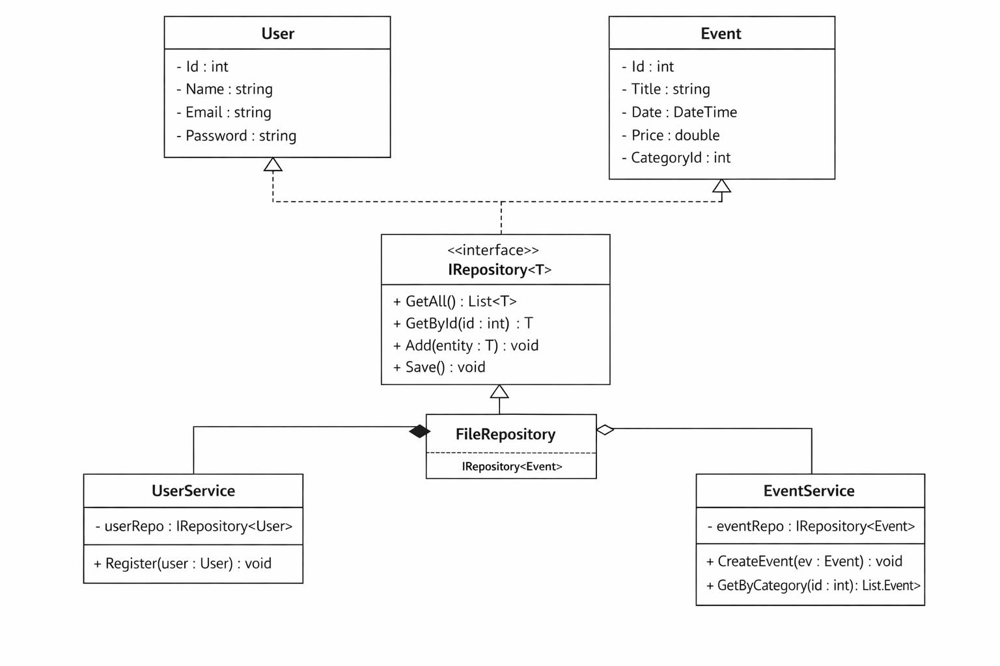

```md id="final_readme"
## UML Diagram



# Event Management System

## 📌 Description
Console application built with C# using layered architecture (Models, Services, Data, UI).

## 🚀 Features
- User registration and login
- Event creation and listing
- Ticket buying system
- Repository pattern with file storage

## 🏗 Architecture
- Models → Data structures (User, Event, Ticket)
- Services → Business logic
- Data → Repository layer (File storage)
- UI → Console interface

## ▶ How to run
```bash
dotnet run
