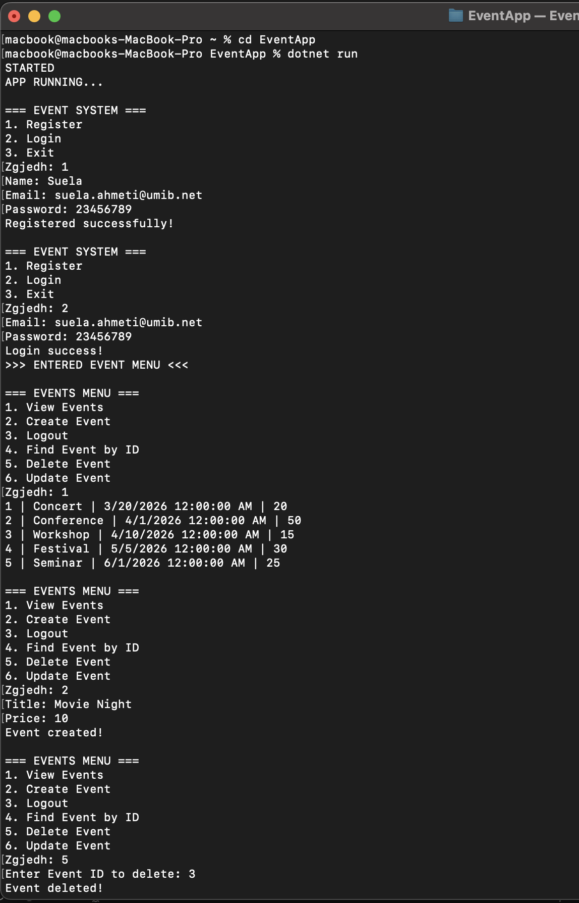
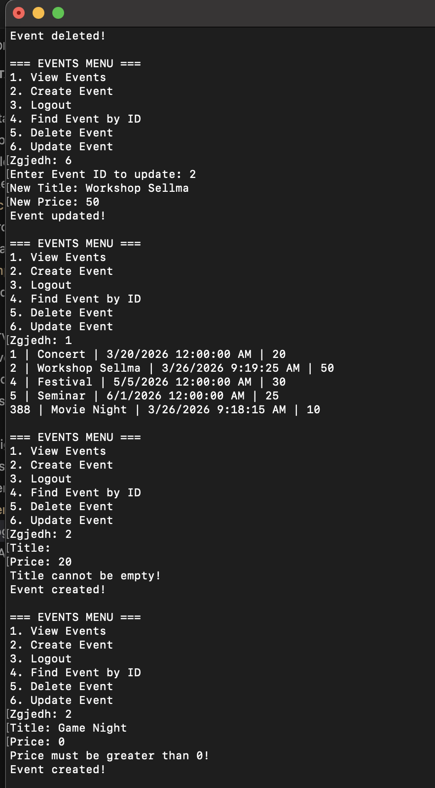

# Implementation

## 📌 Overview

Ky projekt është një sistem për menaxhimin e eventeve i ndërtuar si aplikacion Console në C#.  
Ai përdor një arkitekturë të ndarë në shtresa (Models, Services, Data, UI) dhe implementon operacione të plota CRUD duke përdorur një File Repository (CSV).

---

## 🚀 Features Implemented

- ✔ Regjistrimi dhe kyçja e përdoruesit
- ✔ Krijimi i eventeve (Create)
- ✔ Shfaqja e eventeve nga file (Read)
- ✔ Gjetja e eventit sipas ID
- ✔ Përditësimi i eventit (Update)
- ✔ Fshirja e eventit (Delete)
- ✔ Validimi i inputeve (titulli jo bosh, çmimi > 0)
- ✔ Ruajtja e të dhënave në file CSV

---

## 🏗 System Architecture

Aplikacioni është ndërtuar me arkitekturë të ndarë në 4 shtresa:

### 1. Models
Përmban klasat që përfaqësojnë të dhënat:
- Event
- User
- Ticket
- Category

---

### 2. Services
Përmban logjikën e biznesit:
- Validon të dhënat para se të ruhen
- Thërret repository për operacione CRUD

Shembuj:
- CreateEvent()
- GetByCategory()
- GetById()
- UpdateEvent()
- DeleteEvent()

---

### 3. Data (Repository Layer)
Menaxhon ruajtjen dhe leximin e të dhënave nga file CSV.

- FileRepository implementon IRepository
- Të dhënat ruhen në `events.csv`

Operacione:
- GetAll()
- GetById()
- Add()
- Update()
- Delete()

---

### 4. UI (Console)
Ndërfaqja me përdoruesin përmes menusë:

User → zgjedh opsion → Service → Repository → File

---

## 🔄 Application Flow

Rrjedha e aplikacionit është:

UI → Service → Repository → CSV File

1. Përdoruesi zgjedh një opsion nga menu
2. UI thërret Service
3. Service bën validim dhe logjikë
4. Repository lexon/shkruan në file
5. Rezultati shfaqet në Console

---

## 📁 Data Storage (CSV)

Të dhënat ruhen në file:

events.csv

Shembull:

1,Concert,2026-03-20,20,1,1  
2,Conference,2026-04-01,50,1,1  
3,Workshop,2026-04-10,15,1,1  

---

## 🧪 Example Usage

Përdoruesi mund të:

1. Regjistrohet dhe kyçet
2. Krijojë një event të ri
3. Shikojë listën e eventeve
4. Gjejë një event sipas ID
5. Përditësojë një event
6. Fshijë një event

---

## ⚙️ Validation

Në Service layer bëhet validimi:

- Titulli nuk mund të jetë bosh
- Çmimi duhet të jetë më i madh se 0

Nëse nuk plotësohen kushtet:
→ shfaqet mesazh gabimi në Console

---

## 📸 Screenshot

---

## 📝 Notes

- Repository përdor file CSV për thjeshtësi
- Arkitektura layered ndihmon në mirëmbajtje dhe zgjerim
- Dependency Injection përdoret për lidhjen Service–Repository
- Projekti demonstron implementim të plotë CRUD

---
